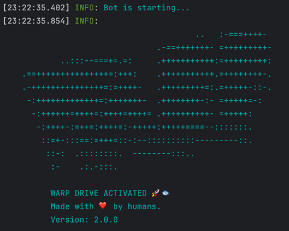

# Solana Trading Bot (Beta)

The Solana Trading Bot is a software tool designed to automate the buying and selling of tokens on the Solana blockchain.
It is configured to execute trades based on predefined parameters and strategies set by the user.

The bot can monitor market conditions in real-time, such as pool burn, mint renounced and other factors, and it will execute trades when these conditions are fulfilled.

## Setup

To run the script you need to:

- Create a new empty Solana wallet
- Transfer some SOL to it.
- Convert some SOL to USDC or WSOL.
  - You need USDC or WSOL depending on the configuration set below.
- Configure the script by updating `.env.copy` file (remove the .copy from the file name when done).
  - Check [Configuration](#configuration) section bellow
- Install dependencies by typing: `npm install`
- Run the script by typing: `npm run start` in terminal

You should see the following output:  

### Configuration

#### Wallet

- `PRIVATE_KEY` - Your wallet's private key.

#### Connection

- `RPC_ENDPOINT` - HTTPS RPC endpoint for interacting with the Solana network.
- `RPC_WEBSOCKET_ENDPOINT` - WebSocket RPC endpoint for real-time updates from the Solana network.
- `COMMITMENT_LEVEL`- The commitment level of transactions (e.g., "finalized" for the highest level of security).

#### Bot

- `LOG_LEVEL` - Set logging level, e.g., `info`, `debug`, `trace`, etc.
- `ONE_TOKEN_AT_A_TIME` - Set to `true` to process buying one token at a time.
- `PRE_LOAD_EXISTING_MARKETS` - Bot will load all existing markets in memory on start.
  - This option should not be used with public RPC.
- `CACHE_NEW_MARKETS` - Set to `true` to cache new markets.
  - This option should not be used with public RPC.
- `TRANSACTION_EXECUTOR` - Set to `warp` to use warp infrastructure for executing transactions, or set it to jito to use JSON-RPC jito executer
  - For more details checkout [warp](#warp-transactions-beta) section
- `CUSTOM_FEE` - If using warp or jito executors this value will be used for transaction fees instead of `COMPUTE_UNIT_LIMIT` and `COMPUTE_UNIT_LIMIT`
  - Minimum value is 0.0001 SOL, but we recommend using 0.006 SOL or above
  - On top of this fee, minimal solana network fee will be applied

#### Telegram Alerts (Optional)
- `TELEGRAM_ALERTS_ENABLED` - Set to `true` to enable sending alerts via Telegram. Default: `false`.
- `TELEGRAM_BOT_TOKEN` - Your Telegram Bot API token (obtained from BotFather). Required if alerts are enabled.
- `TELEGRAM_CHAT_ID` - The ID of the Telegram chat (user, group, or channel) where alerts should be sent. Required if alerts are enabled.

#### Priority Fees
*   `USE_PRIORITY_FEES` (boolean): Enable/disable priority fees for transactions. Uses `COMPUTE_UNIT_LIMIT` and `COMPUTE_UNIT_PRICE` when `true`. Default: `true`.
*   `COMPUTE_UNIT_LIMIT` (number): Compute unit limit for transactions when priority fees are enabled. Default: `101337`.
*   `COMPUTE_UNIT_PRICE` (number): Compute unit price (in micro-lamports) for transactions when priority fees are enabled. Default: `421197`.

#### Buy

- `QUOTE_MINT` - Which pools to snipe, USDC or WSOL.
- `QUOTE_AMOUNT` - The amount of quote token to spend on each buy transaction (e.g., `0.01`). **Warning:** Ensure this is entered in the correct denomination (e.g., for 0.01 SOL, use `0.01`, not `10000000`).
- `AUTO_BUY_DELAY` - Delay in milliseconds before buying a token.
- `MAX_BUY_RETRIES` - Maximum number of retries for buying a token.
- `BUY_SLIPPAGE` - Slippage %. Default: `10`.
- `AUTO_BUY` - Set to `true` to automatically execute buys when filters pass. Set to `false` to run in monitor-only mode (logs filter results but doesn't buy). Default: `true`.

#### Sell

- `AUTO_SELL` - Set to `true` to enable automatic selling of tokens.
  - If you want to manually sell bought tokens, disable this option.
- `MAX_SELL_RETRIES` - Maximum number of retries for selling a token.
- `AUTO_SELL_DELAY` - Delay in milliseconds before auto-selling a token.
- `PRICE_CHECK_INTERVAL` - Interval in milliseconds for checking the take profit and stop loss conditions.
  - Set to zero to disable take profit and stop loss.
- `PRICE_CHECK_DURATION` - Time in milliseconds to wait for stop loss/take profit conditions.
  - If you don't reach profit or loss bot will auto sell after this time.
  - Set to zero to disable take profit and stop loss.
- `TAKE_PROFIT_PERCENTAGE` - Percentage gain at which to automatically sell the token (e.g., `100` for 100%). Set to 0 to disable.
- `STOP_LOSS_PERCENTAGE` - Percentage loss at which to automatically sell the token (e.g., `15` for 15%). Set to 0 to disable. Default: `15`.
- `MAX_SELL_DURATION_SECONDS` - Maximum time (in seconds) to hold a token before attempting to sell, regardless of PNL. Set to 0 to disable. Default: `120`.
- `SELL_TIMED_NAME_KEYWORDS` - Comma-separated list of keywords in the token name to trigger a timed sell (e.g., `meme,moon`). Case-insensitive.
- `SELL_TIMED_NAME_DURATION_SECONDS` - Time (in seconds) to hold a token whose name matches `SELL_TIMED_NAME_KEYWORDS` before attempting to sell.
- `SELL_SLIPPAGE` - Slippage %. Default: `10`.

#### Snipe list

- `USE_SNIPE_LIST` - Set to `true` to enable buying only tokens listed in `snipe-list.txt`.
  - Pool must not exist before the bot starts.
  - If token can be traded before bot starts nothing will happen. Bot will not buy the token.
- `SNIPE_LIST_REFRESH_INTERVAL` - Interval in milliseconds to refresh the snipe list.
  - You can update snipe list while bot is running. It will pickup the new changes each time it does refresh.

Note: When using snipe list filters below will be disabled.

#### Filters

- `FILTER_CHECK_INTERVAL` - Interval in milliseconds for checking if pool match the filters.
  - Set to zero to disable filters.
- `FILTER_CHECK_DURATION` - Time in milliseconds to wait for pool to match the filters.
  - If pool doesn't match the filter buy will not happen.
  - Set to zero to disable filters.
- `CONSECUTIVE_FILTER_MATCHES` - How many times in a row pool needs to match the filters.
  - This is useful because when pool is burned (and rugged), other filters may not report the same behavior. eg. pool size may still have old value
- `CHECK_IF_MUTABLE` - Check if the token metadata is mutable (true/false).
- `CHECK_IF_SOCIALS` - Check if the token has social media links (true/false).
- `CHECK_IF_MINT_IS_RENOUNCED` - Set to `true` to buy tokens only if their mint is renounced. Default: `true`.
- `CHECK_IF_FREEZABLE` - Set to `true` to buy tokens only if they are not freezable. Default: `true`.
- `CHECK_IF_BURNED` - Set to `true` to buy tokens only if their liquidity pool is burned. Default: `true`.
- `MIN_POOL_SIZE` - Minimum liquidity pool size (in `QUOTE_MINT` amount, e.g., WSOL). Pools smaller than this will be ignored. Set `0` to disable. Default: `5`.
- `MAX_POOL_SIZE` - Maximum liquidity pool size (in `QUOTE_MINT` amount, e.g., WSOL). Pools larger than this will be ignored. Set `0` to disable. Default: `50`.
- `MIN_MARKET_CAP` - Minimum market cap (FDV = (total supply - burned supply) * Price) in quote tokens (e.g., 10000 for $10k). Pools below this will be ignored. Set `0` to disable. Default: `0`.
- `MAX_POOL_AGE_SECONDS` - Maximum age of the liquidity pool in seconds. Pools older than this will be ignored. Set to `0` to disable this check. Default: `1200` (20 minutes).
- `FILTER_BLOCKLIST_NAMES` - Comma-separated list of token names to block (case-insensitive). Example: `PUMP,BadToken`.
- `FILTER_BLOCKLIST_SYMBOLS` - Comma-separated list of token symbols to block (case-insensitive). Example: `TRUMP,BAD`.

## Warp transactions (beta)

In case you experience a lot of failed transactions or transaction performance is too slow, you can try using `warp` for executing transactions.
Warp is hosted service that executes transactions using integrations with third party providers.

Using warp for transactions supports the team behind this project.

### Security

When using warp, transaction is sent to the hosted service.
**Payload that is being sent will NOT contain your wallet private key**. Fee transaction is signed on your machine.
Each request is processed by hosted service and sent to third party provider.
**We don't store your transactions, nor we store your private key.**

Note: Warp transactions are disabled by default.

### Fees

When using warp for transactions, fee is distributed between developers of warp and third party providers.
In case TX fails, no fee will be taken from your account.

## Common issues

If you have an error which is not listed here, please create a new issue in this repository.
To collect more information on an issue, please change `LOG_LEVEL` to `debug`.

### Unsupported RPC node

- If you see following error in your log file:  
  `Error: 410 Gone:  {"jsonrpc":"2.0","error":{"code": 410, "message":"The RPC call or parameters have been disabled."}, "id": "986f3599-b2b7-47c4-b951-074c19842bad" }`  
  it means your RPC node doesn't support methods needed to execute script.
  - FIX: Change your RPC node. You can use Helius or Quicknode.

### No token account

- If you see following error in your log file:  
  `Error: No SOL token account found in wallet: `  
  it means that wallet you provided doesn't have USDC/WSOL token account.
  - FIX: Go to dex and swap some SOL to USDC/WSOL. For example when you swap sol to wsol you should see it in wallet as shown below:

## Contact

- If you want to leave a tip, you can send it to the following address:
  `7gm6BPQrSBaTAYaJheuRevBNXcmKsgbkfBCVSjBnt9aP`

- If you need custom features or assistance, feel free to contact the admin team on discord for dedicated support.

## Disclaimer

The Solana Trading Bot is provided as is, for learning purposes.
Trading cryptocurrencies and tokens involves risk, and past performance is not indicative of future results.
The use of this bot is at your own risk, and we are not responsible for any losses incurred while using the bot.

## Transaction Handling

The bot includes robust transaction handling:
*   **Priority Fees**: Uses dynamic priority fees based on network conditions to improve transaction confirmation speed.
*   **Retries**: Automatically retries failed transactions up to a configured limit (`MAX_SELL_RETRIES`).
*   **Simulations**: Simulates swaps before execution to estimate outcomes and prevent costly errors.

### Selling Strategies

The bot employs a multi-layered selling strategy:

1.  **Profit/Loss (PNL) Based:**
    *   **Take Profit:** Automatically sells if the token's value increases by `TAKE_PROFIT_PERCENTAGE` compared to the initial buy cost.
    *   **Stop Loss:** Automatically sells if the token's value decreases by `STOP_LOSS_PERCENTAGE` compared to the initial buy cost.
2.  **Time Based:**
    *   **Max Duration:** Sells any token held longer than `MAX_SELL_DURATION_SECONDS`, regardless of PNL.
    *   **Timed Keyword Sell:** If a token's name contains keywords defined in `SELL_TIMED_NAME_KEYWORDS`, it will be sold after being held for `SELL_TIMED_NAME_DURATION_SECONDS`. This can be used for specific strategies targeting certain types of tokens.

The sell checks prioritize PNL, then max duration, then timed keywords.

### Internal Refinements (Developer Note)

Recent updates include refactoring the buy logic (`bot.ts`) to use `Liquidity.fetchInfo` from the Raydium SDK. This fetches comprehensive pool and market data directly, improving type safety and reliability compared to previous methods involving manual data assembly or type assertions.

## Contributing

Contributions are welcome! Please follow standard coding practices and submit pull requests for review.
